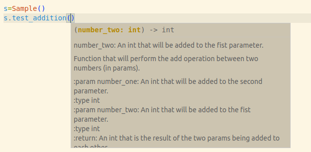

[](https://classroom.github.com/a/7FRBay4U)
# Wikipedia Scraper 

- Repository: `wikipedia_scraper`
- Type of Challenge: `Consolidation`
- Duration: `3 days`
- Deadline: `22/09/2023 5:00 PM`
- Team challenge : `solo`

## Mission objectives

In this project, we will guide you step by step through the process of:

1. creating a self-contained development environment.
1. retrieving some information from an API (a website for computers)
2. leveraging it to scrape a website that does not provide an API
3. saving the output for later processing

Here we query an API for a list of countries and their past leaders. We then extract and sanitize their short bio from Wikipedia. Finally, we save the data to disk.

This task is often the first (coding) step of a datascience project and you will often come back to it in the future.

You will study topics such as *oop*, *scraping*, *data structures*, *exception handling*, *regular expressions*, *concurrency* and *file handling*.  


## Learning Objectives

- Use the [requests](https://requests.readthedocs.io/en/latest/) external library through the `import` keyword.
- Use [venv](https://docs.python.org/3/library/venv.html) to isolate your python environment
- Use proper exception handling
- Get confortable with json 
- Call external API
- Use OOP and split functionnalities into functions
- Use BeautifulSoup to extract text from html
- Use regex to clean text data
-  _Optional_ : use multiprocessing to speedup your code

## The Mission

Create a scraper that builds a json file with the leaders of each countries you get from this [API](https://country-leaders.onrender.com/docs)

Include in this file the first paragraph of the wikipedia page of these leaders (you'll retrieve the wikipedia page url from the API). 

### Must-have features
- Working program that call the API and creates a .json file
- proper exception handling (Create your own exception)
- README with installation and execution instruction (venv creation - library installation - progam execution)


### Nice-to-have features
- possibility to store the file as a csv instead of json
- speedup execution using multiprocessing 
- use [Session](https://requests.readthedocs.io/en/latest/user/advanced/) from requests instead of `get()`

    #### To go further

    If you want to practice scraping, you can read this section and tackle the exercise.

    You have noticed the API returns very partial results for country leaders. Many are missing. Overwrite the `get_leaders()` function to get its list from Wikipedia and extract their *personal details* from the frame on the side.


### Constraints

#### Imports

```python
# You CAN'T import like this:
import whatever_file
# You CAN'T import like this:
import .whatever_file
# You CAN'T import like this:
from .whatever_file.whatever_function
# You CAN'T import like this:
from .whatever_function
# You CAN'T import like this:
from whatever_file
```

```python
# You CAN import like this:
from whatever_file import whatever_function_or_class
```

#### Code style

- Each **class** should have a [`__str__()` method](https://medium.com/swlh/understanding-repr-and-str-in-python-65dd41538943).
- Each **function or class** has to be **typed**
- Each **function or class** has to contain a **docstring** formatted like this:

```python
def add(number_one: int, number_two: int) -> int:
    """
    Function that will perform the add operation between two numbers (in params).

    :param number_one: An int that will be added to the second parameter.
    :type int
    :param number_two: An int that will be added to the fist parameter.
    :type int
    :return: An int that is the result of the two params being added to each other.
    """
    result = number_one + number_two
    return result
```
why is docstring useful ? 



- Your code should be **formatted** with [black](https://pypi.org/project/black/).
- Your code should be **commented**.
- Your code should be **cleaned of any commented unused code**.

#### Repo

- Your repo should only contain the files specified.
- Your README should be nice and complete (see the #Deliverables section below). Feel free to add more information.

Please keep the must-have version separate from the nice-to-have version by using a different branch on GitHub. Please specify that in your README too.

### Steps

It goes without saying, but please, **read through all of this before starting.**


Here are a list of popular IDEs or text editors to choose from:

- [vscode](https://code.visualstudio.com/) (IDE/Text editor)
- [PyCharm](https://www.jetbrains.com/pycharm/) (IDE)
- [Atom](https://atom.io/) (Text editor)
- [Sublime Text](https://www.sublimetext.com/) (Text editor)
- [vim](https://www.vim.org/) (Text editor)

Now, let's get to the heart of it!
And I repeat, **read through all of this before starting.**

#### 0. Setup and preparation

- create a virtual environment using [venv](https://docs.python.org/3/library/venv.html)
- create a `requirements.txt` file with the needed libraries
- create a `utils` folder where you'll put the `scraper.py` file
- **read the doc from the [api](https://country-leaders.onrender.com/docs)!!**
- Create a GitHub repo from the `wikipedia_template` 
- Check the notebook `wikipedia_scraper.ipynb` for example hint about calling the API , etc.
    - calling endpoints
    - handling cookies
    - extract text with `BeatifulSoup`


You're ready to go!


#### 1. `scraper.py`


##### 1.1 WikipediaScraper
Scraper object that allow you to retrieve data from the api.

6 attributes : 
- `base_url` : `str` base url of the api : `https://country-leaders.onrender.com`
- `country_endpoint` : `str`  → `/countries` → endpoint to get the list of supported countries
- `leaders_endpoint` : `str`  → `/leaders` →  endpoint to get the list of leaders for a specific country
- `cookies_endpoint` : `str`  → `/cookie` → endpoint to get a valid cookie to query the api
- `leaders_data : dict` : dictionary where you store the data you retrieve before saving them into the json file
- `cookie : object` cookie object used for api calls

5 functions :

- `refresh_cookie() -> object` returns a new cookie if the cookie has expired
- `get_countries() -> list` return a list of the supported countries from the api
- `get_leaders(country: str) -> None ` populate the `leader_data` object with the leaders of a country retrieved from the api
- `get_first_paragraph(wikipedia_url:str) -> str` return the first paragraph( defined by html tag `<p>` ) with informatons about the leader.
- `to_json_file(filepath : str) -> None` : store data structure into a json file


## Deliverables

1. Publish your source code on the GitHub repository.
2. Pimp up the README file:
   - Description
   - Installation
   - Usage
   - (Visuals)
   - (Contributors)
   - (Timeline)
   - (Personal situation)

## Evaluation criteria

| Criteria       | Indicator                                                    | Yes/No |
| -------------- | ------------------------------------------------------------ | ------ |
| 1. Is complete | execute whithout errors              |        |
|   | store the correct informations from the api in the file   |   |
|   
| 2. Is correct  | The code is well typed.                                      |        |
|   | Good usage of OOP|    |
|                |        |        |
| 3. Is great    | Possibility to store as CSV                        |        |
|   | Multiprocessed|   |
|   | Correct usage of session| |
|   | Wikipedia scraping to get country leader list and leader details   |
|   |   |


## Final note


